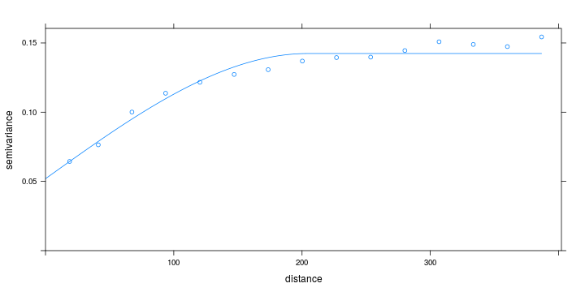
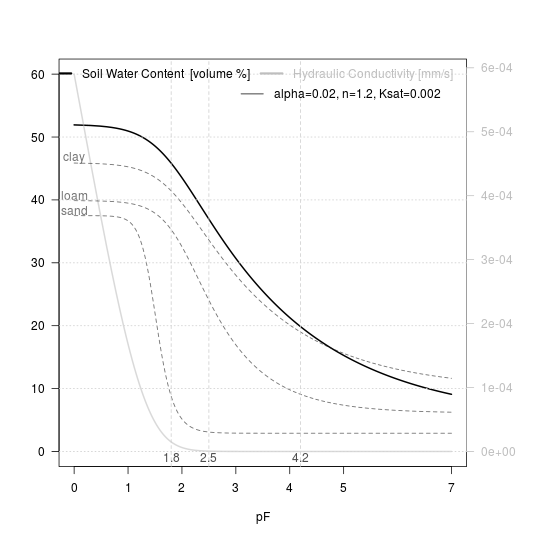
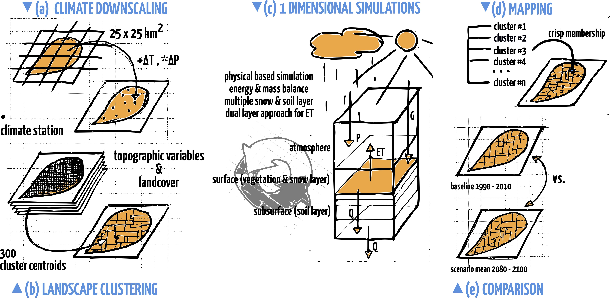

## Content

all following R libraries are hosted on my GitHub account: [https://github.com/JBrenn](https://github.com/JBrenn)

> 1. **[DataBaseAlpEnvEURAC](https://github.com/JBrenn/DataBaseAlpEnvEURAC)** - from raw LTER data to database: reading, formating, writing Mazia LTER data; post-process WISKI .rzx files
> 2. **[SMCcalibration](https://github.com/JBrenn/SMCcalibration)** - interactive shiny app for calibrating SMC sensors
> 3. **[SpatialInterpol](https://github.com/JBrenn/SpatialInterpol)** - spatial interpolation using local ordinary kriging and inverse distance weighting
> 4. **[AnalyseGEOtop](https://github.com/JBrenn/AnalyseGEOtop)** - GEOtop simulation analysis
> 5. **[TopoSUB](https://github.com/JBrenn/TopoSUB)** - landscape k-means clustering & land-surface modeling with GEOtop
> 6. **[SoilMoisturePattern](https://github.com/JBrenn/SoilMoisturePattern)** - mobile campaigns' SMC data (project HiResAlp)

<div class='source'>
  The content of this presentation is covered by the R script "KnowledgTransferEURAC_main.R. You can find it in "//ABZ02FST/alpenv/Präsentationen/BrJ_KnowledgeTransfer".
</div>

---

## Intro R & GitHub

+ version control
+ branching
+ R packages in GitHub can be installed with __devtools::install_github__:


```r
library(devtools)
# install master branch
install_github("JBrenn/DataBaseAlpEnvEURAC")
# install different branch
install_github("JBrenn/SMCcalibration@download")
```

+ place to gather alpenv scripts?

---

## DataBaseAlpEnvEURAC - get data 1

+ base function is **dB_readStationData**

+ **dB_updatedb**: writing, updating SQlite database for specific variables or total data set (multiple stations and .csv output supported) - preperation for LTER database with fixed headers

+ **dB_getMETEO**: get meteo data  
+ **dB_getGEOtop**: get meteo data and convert to standard GEOtop meteo file format (multiple stations supported)
+ **dB_getSWC**: get soil moisture data
+ **dB_getSoilTemp**: get soil temperature data 
+ **dB_getSWP**: get soil water pressure (B2)

--- bg:#EEE

## DataBaseAlpEnvEURAC - get data 2


```r
# load libraries
library(DataBaseAlpEnvEURAC); library(dygraphs)

# easy data access, e.g. SWC data station P2
path2data <- "/media/alpenv/Projekte/HiResAlp/06_Workspace/BrJ/02_data/Station_data_Mazia"
P2 <- dB_getSWC(path2data = path2data, station = "P2", aggregation = "h", 
                minVALUE = 0, maxVALUE = 1, write.csv = FALSE, path2write = "./")
# use calibration function
data("calibration"); View(calibration)
P2_cal <- dB_getSWC(path2data = path2data, station = "P2", aggregation = "h", 
                    minVALUE = 0, maxVALUE = 1, calibrate=T)
# compare
P2_merge <- merge(P2[,1], P2_cal[,1])
time(P2_merge) <- as.POSIXct(time(P2_merge))
dygraph(P2_merge) %>%
  dyRangeSelector() %>% dyRoller()
```

---


<iframe src="./assets/widgets/dygraph1.html" width=100% height=100% allowtransparency="true"> </iframe>

--- bg:#EEE

## DataBaseAlpEnvEURAC - update database


```r
# creating .sqlite database for specific variables or total data
# for SWC .sqlite database is copied in data folder of SMCcalibrate package
# this is needed for downloading data with the calibration shiny app

P <- dB_updatedb(stations = c("P1","P2","P3"), variables = "SWC", 
                 inCloud = "/home/jbre/Schreibtisch/", 
                 write_csv = F, return_data = T)
```

+ **variables**: "TOTAL", "METEO", "SWC", "TSoil"
+ multiple stations and variables supported
+ possibility to write .csv for each station
+ handle .sqlite with R package *RSQlite* or specific software (e.g. [Sqliteman](https://sourceforge.net/projects/sqliteman/))

--- bg:#EEE

## SMCcalibration


```r
# load libraries
library(SMCcalibration)
library(shiny)

# easy data access
data("SensorVSample")

# data description
?SensorVSample
View(SensorVSample)

# reduce data
data <- unique(data[,-8])

# run shiny app
shinyApp(ui, server)
```

--- bg:#EEE

## DataBaseAlpEnvEURAC - postprocess .zrx 

+ **dB_readZRX** - read ZRX data file, working for single variable and multiple variables in .zrx file
+ intern use by **dB_readZRX2station** - process ZRX data files, returns .csv file for each station containing available variables and station meta data.


```r
files <- dir("/home/jbre/Schreibtisch/zrx/SouthTyrol", full.names = T)
data <- dB_readZRX2station(files = files, write_csv = F, 
                           multivar = FALSE)

path <- "/home/jbre/Schreibtisch/zrx/Mazia0480"
files <- dir(path, full.names = T)
mazia <- dB_readZRX2station(files = files, write_csv = T, output_path = path, 
                            multivar = TRUE)
# show data.table
library(DT)
matschdata <- read_csv(file.path(path,"st0480_1440.csv"))
datatable(matschdata)
```

---

### Matsch-0480 data after postprocess

<iframe src="./assets/widgets/dt1.html" width=100% height=100% allowtransparency="true"> </iframe>

---

## Intro Rmarkdown

+ **.Rmd files** - An R Markdown (.Rmd) file is a record of your research. It contains the code that a scientist needs to reproduce your work along with the narration that a reader needs to understand your work.

+ **Reproducible Research** - At the click of a button you can rerun the code in an R Markdown file to reproduce your work and export the results as a finished report.

+ **Dynamic Docs** - You can choose to export the finished report as a html, pdf, MS Word, ODT, RTF, or markdown document; or as a html or pdf based slide show.

Example: 
+ Download or clone Git repository DataBaseAlpEnvEURAC
+ In the folder *Rmd* find the file **01_data_preparation_climate_quality.rmd**
+ open/run in RStudio

<div class='source'>
  Source <a href='http://www.rstudio.com/wp-content/uploads/2016/03/rmarkdown-cheatsheet-2.0.pdf'>R Markdown Cheat Sheet</a>
</div>


<style>
em {
  font-style: italic
}
strong {
  font-weight: bold;
}
</style>

--- bg:#EEE

## SpatialInterpol


```r
library(SpatialInterpol)
ordkrig100 <- OrdKrig(datafolder = "master")
#ordkrig20  <- OrdKrig(datafolder = "master", npix = 20)
idw     <- OrdKrig(datafolder = "master", inverseDistWeigths = TRUE)
plot(ordkrig100$AdigeVenosta$vario, ordkrig100$AdigeVenosta$vario_fit)
```



---

### SpatialInterpol results

<iframe src="./assets/widgets/leaflet1.html" width=100% height=100% allowtransparency="true"> </iframe>

---

## Analyse GEOtop

+ R markdown docs on time series visualisation, GOFs for comparision with observed time series, and simple visual sensitivity
+ read GEOtop 1d simulation output: **GEOtop_ReadPointData**, **GEOtop_readValidationData**
+ Create Geotop input maps with __RSAGA__: **GEOtop_CreateInptsMAPS**
+ Hydrological Budget for 3d simulations: **GEOtop_CheckHydroBudget**
+ Output map animation: **GEOtop_AnimateMaps**

+ Visualisation of pF-Curves: **GEOtop_VisSoilWaterRet** (base), **GEOtop_VisSoilWaterRet_gg** (ggplot2)

---


```r
library(AnalyseGeotop)
GEOtop_VisSoilWaterRet(alpha = 0.02, n = 1.2, theta_sat = 0.52, theta_res = 0.05, 
                       ksat = 0.002, add_ref_curves = T, png = F, accurate = 1)
```



---

## TopoSUB

<div class="figure" style='text-align: center;'>
    <p>
    <p>TopoSUB methodology - R functions to use for specific tasks: <br> (b) + (c) TopoSUB_preprocessor, (d) TopoSUB_read and  TopoSUB_remap, (e) shiny app
</div>

---


## Vignettes in R

+ long-form documentation for R packages
+ install GitHub packages with vignettes accordingly


```r
library(devtools)

# install GitHub R package & build vignettes
install_github("JBrenn/TopoSUB", build_vignettes = TRUE)

# browse for package vignettes or look them up in package directory ("doc")
library(TopoSUB)
browseVignettes("TopoSUB")
```

+ [Run a TopoSUB simulation](http://127.0.0.1:21307/library/TopoSUB/doc/Lect_1_RunTopoSUB.html)
+ [Postprocess a TopoSUB simulation](http://127.0.0.1:21307/library/TopoSUB/doc/Lect_2_Postprocess.html)
+ [Visualize a TopoSUB simulation](http://127.0.0.1:21307/library/TopoSUB/doc/Lect_3_Visualisation.html)

--- {
 tpl: thankyou,
 social: [{title: github, href: "https://github.com/JBrenn"}]
}

## Thank You

For more information you can browse

<div class='source'>
  This presentation is built with <a href='http://slidify.org/'>slidify</a> THANKS to the developer <a href='https://github.com/ramnathv'>Ramnath Vaidyanathan</a>. <br>
    The content of this presentation is covered by the R script "KnowledgTransferEURAC_main.R". You can find it in "//ABZ02FST/alpenv/Präsentationen/BrJ_KnowledgeTransfer/".
</div>

---

<iframe src=' assets/fig/HiResAlp-1.html ' scrolling='no' frameBorder='0' seamless class='rChart polycharts ' id=iframe- chart119f37881c75 ></iframe> <style>iframe.rChart{ width: 100%; height: 400px;}</style>


<style>
em {
  font-style: italic
}
strong {
  font-weight: bold;
}
div.figure {
  float: right;
  width: 90%;
  margin: 0.5em;
  padding: 0.5em;
}
div.figure p {
  text-align: left;
  font-style: italic;
  font-size: smaller;
  text-indent: 0;
}
</style>
